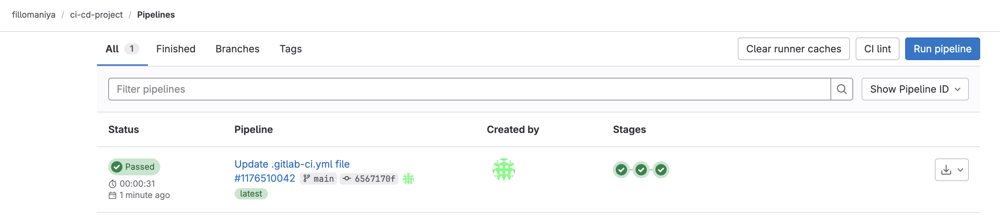
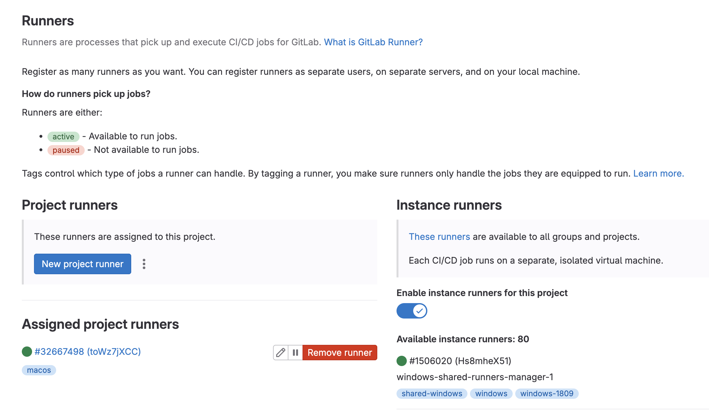
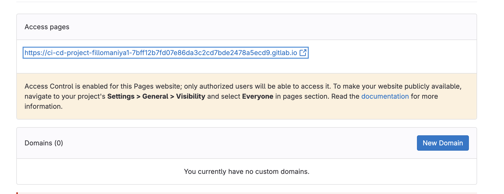
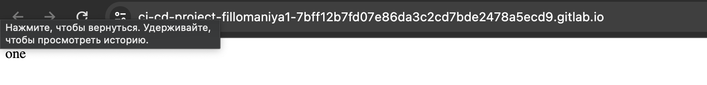
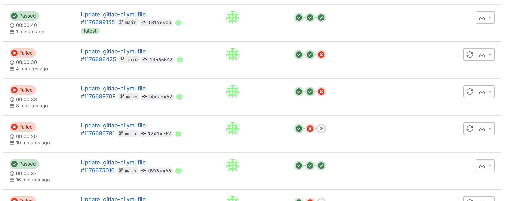
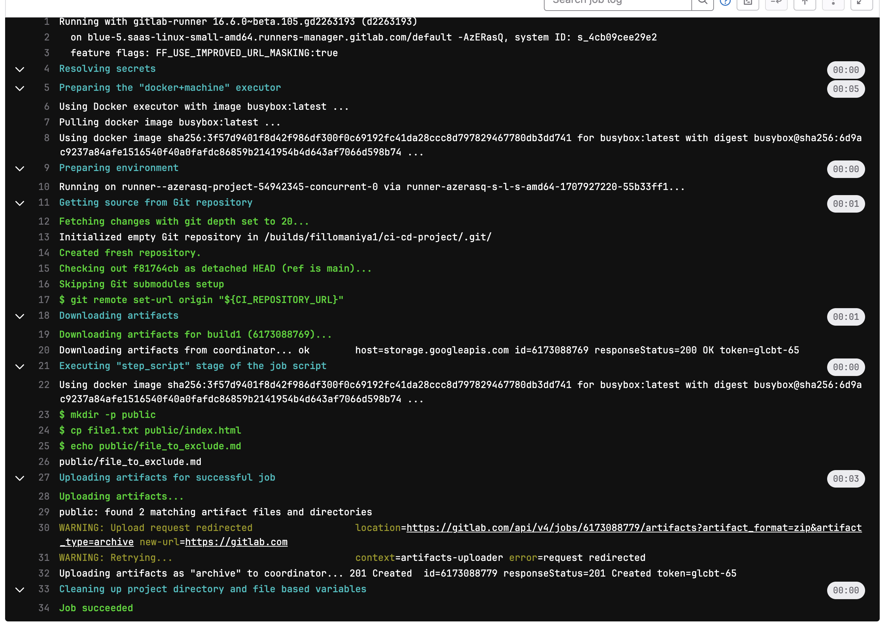
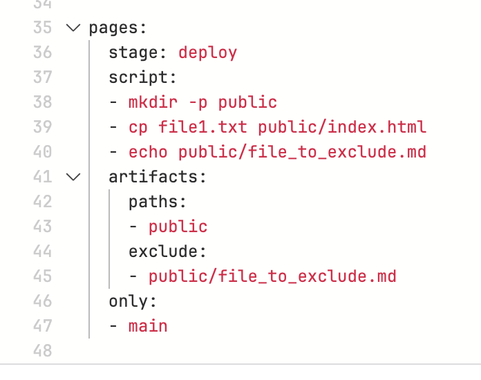
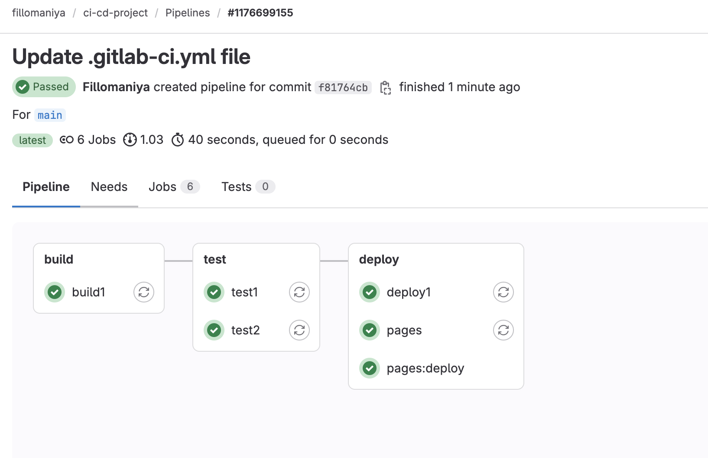

# ci-cd-homeworks
скажу честно - разобраться было очень тяжело, не знаю как пойдет дальше.\
здесь я создал pipeline  

---
далее запустил раннер локально прям в системе mac os, но как я понимаю, если у меня получилось пройти верификацию на сатйе с иностранной картой, то там уже автоматом запускается свой раннер. Создал локально, чтобы попробовать, как он работает, и он даже запустился  
  
---
Следом прописал код, как было на уроке, и создал pages  
  

---
много раз ковырялся с тестами, как на уроке, поэтому список пайплайнов собрался внушительный  
  
---
в итоге получилось после создания pages так же сделать исключение из артефактов  
  
---
судя по коду внутри это все сработало  
  
---
но у меня остался вопрос: если все сработало, и ошибок никаких в пайплайне не отобразилось  
  
---
почему после создания pages в папке репы эта самая директория public не отображается? где она тогда вообще лежит? ведь страница создалась беспроблемно  
---
еще дополнение: этот комп у меня на время, если вдруг не получится завершить остальные домашки на нем, буду делать с виртуальной машины на другом компе