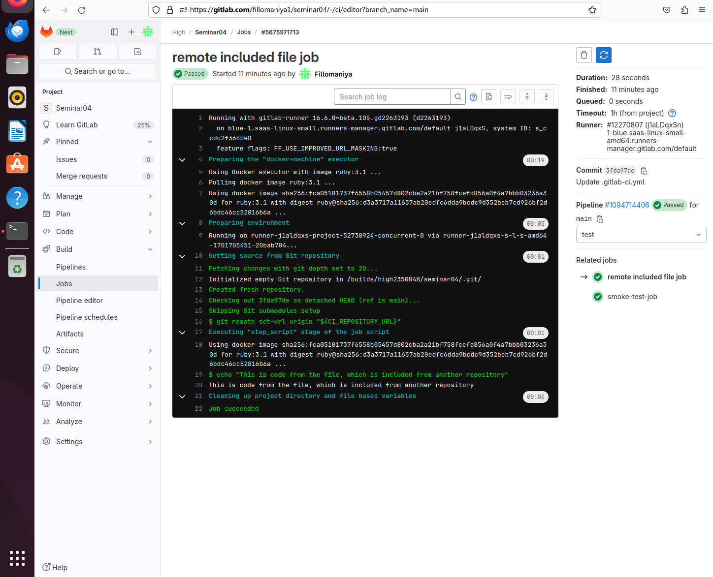
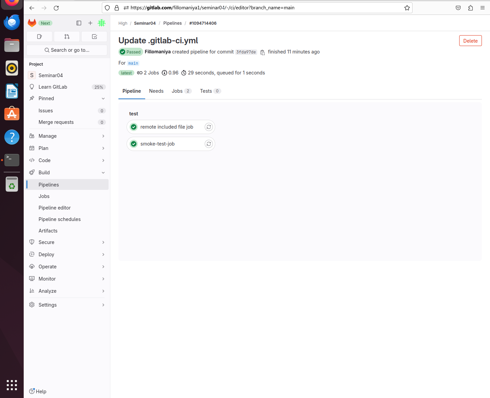

Создан локальный файл `local-smoke-tests.gitlab-ci.yml`

```yaml
smoke-test-job:
  script: echo "SMOKE"
```

Создан основной файл `.gitlab-ci.yml`

```yaml
include:
  - local: local-smoke-tests.gitlab-ci.yml
# ссылку взял рандомно у сокурсника:
  - remote: https://gitlab.com/ci-cd7655047/5/-/raw/main/remote-included-file.yml
```

Файл с аналогичным содержанием есть в этом репозитории: `remote_included-file.yml`

Repository Seminar04 


Remote included file job


Pipeline passed


